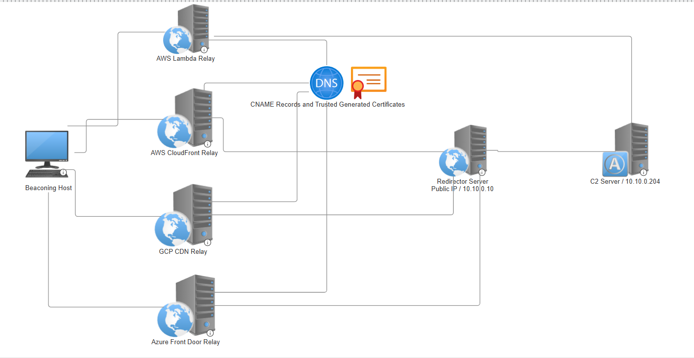

## Red Team Terra
Red Team Terra is a collection of Terraform templates and modules designed to help security teams deploy and manage their red teaming infrastructure in the cloud. It provides a set of reusable components that can be easily customized to meet the specific needs of your organization.

## Features
- **Modular Design**: Red Team Terra is built using Terraform modules, making it easy to reuse and customize components for your specific needs.
- **Relays in 3 Biggest Cloud Providers**: The project includes Terraform templates for deploying relays in AWS, Azure, and GCP, allowing you to choose the cloud provider that best fits your requirements. Or use all of them for larger campaigns.

## Getting Started
- **Terraform**: Make sure you have Terraform installed on your local machine. You can download it from the [Terraform website](https://www.terraform.io/downloads.html).
- **Cloud Provider Account**: You will need an account with the cloud provider(s) you plan to use (AWS, Azure, GCP, CloudFlare).
- **AMIs**: The project is setup to create an internal network in AWS using an apache guacamole server for administration, a C2 Server, a development windows host for c2 payloads & testing, an attacking host used to setup phishing campaigns or distributing the payloads and finally a redirector that will be the front facing host C2 payloads will connect to.
  - The AMIs are not included in this repository, and you'll have to develop your own. I may later down the road, include AMIs I have created and setup using ansible.
- **Variables**: All of the variables that need to be defined to get started with the project can be found in the following files: ec2.tf (AMI image IDs), vars.tf (provider information and other variables), and main.tf (the names of the domains you want to use setting up your relays).
  - If you want to standup more relays that 1 in each service offering, you'll need to copy the module, rename it and provide it a new domain name in the main.tf file.
  - This allows for quick expansion of the infrastructure if you need to scale up your operations.

## Process Flow
- **Step 1**: Assuming you've defined everything correctly, the Terraform scripts should create an environment in AWS where the only internet accessible devices are the redirector server, and the apache guacamole server which you'll use for administration of the other hosts.
- **Step 2**: Once the AWS environment has been provisioned, the Terraform scripts will associate the public IP address of the redirector with a domain name you own in CloudFlare.
- **Step 3**: The Terraform scripts will then create 4 relays, 1 in Azure, GCP, and 2 in AWS (CloudFront vs. Lambda), which will all point to your redirector.
  - With the exception of the AWS Lambda Relay, which will point to the C2 server directly as it will be provisioned within the same internal VPC as the C2 server.

## Architecture Diagram

## Credits
- **The internal network setup** was inspired & written by White Knight Labs for their [ARTO](https://training.whiteknightlabs.com/live-training/advanced-red-team-operations-certification/) course. Highly recommend taking the course to learn more about this topic in depth.